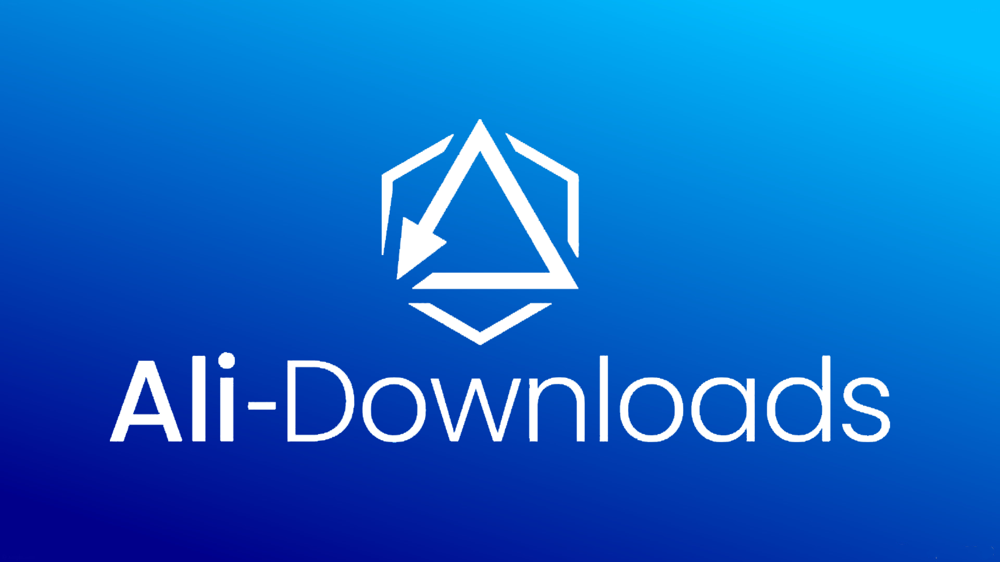
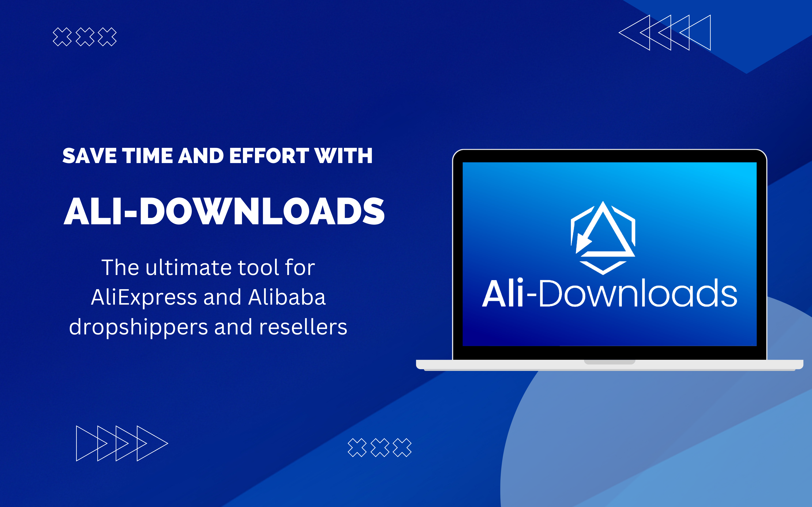
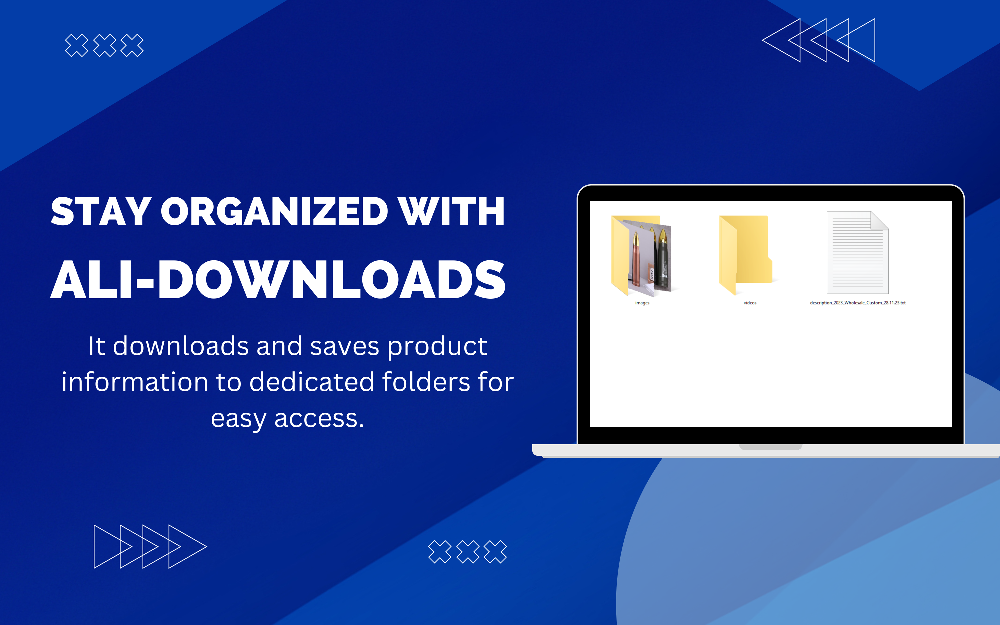
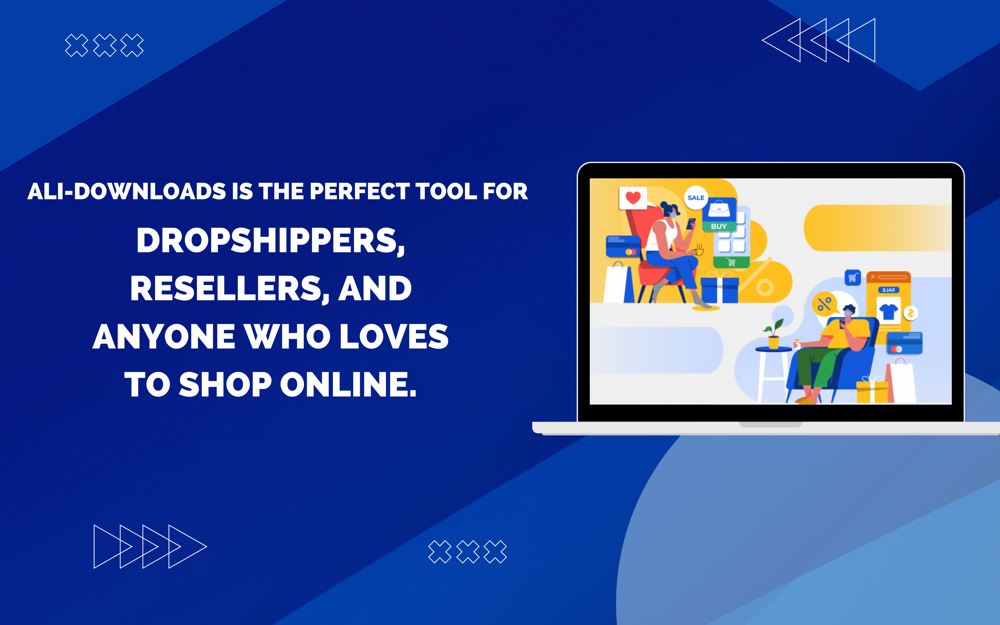

# AliDownloads Extension 🌍💻

AliDownloads is a powerful browser extension designed to make your AliBaba and AliExpress shopping experience even better. With AliDownloads, you can effortlessly download any product information from these platforms, ensuring you save time and stay organized. Learn more about AliDownloads and explore its features on our [official website](https://ali-downloads.digital/).

## Features 🚀

- **Effortless Product Downloading** 📥: Download all components of a product listing seamlessly. This includes images, videos, and product descriptions, all organized neatly in respective folders.
  
- **Intuitive User Interface** 🖱️: No complex settings or configurations. Simply choose what you want to download and let the extension do its magic.

- **Built with Simplicity** 🌟: The extension is crafted using standard HTML, CSS, and JavaScript, ensuring compatibility and smooth performance across browsers.

## Tech Stack 🛠️

- **Extension**: HTML, CSS, JavaScript
  - Library: [JSZip](https://stuk.github.io/jszip/) for efficiently handling and packaging files.
  
- **Website**: HTML with Tailwind CSS for the sleek design

## Gallery 🖼️

## Contributing 🤝

We're always looking for contributors to help improve AliDownloads! If you've got any suggestions, features, or bugs to report, please do so in the issues section. And if you're a developer wanting to contribute, feel free to fork and create a pull request. All contributions are welcome!

## License 📄

This project is licensed under the MIT License. See `LICENSE` for more details.

## Acknowledgments 🙏

- Thanks to everyone who has contributed to this project, provided feedback, or used AliDownloads in their daily routines. Your support is invaluable!
